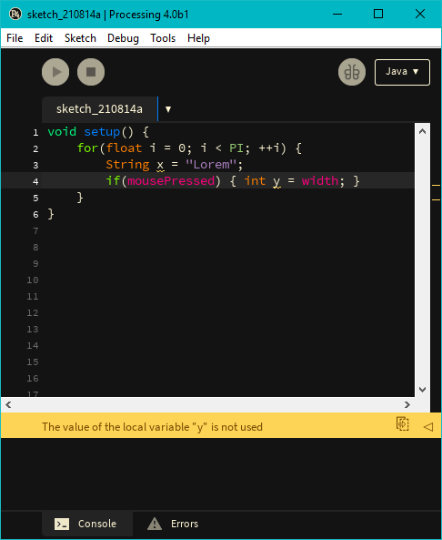

# Dark Theme For Processing 4 Beta

Images and theme for a Processing 4 beta. Navigate to Processing's installation folder, locate the `lib` folder, replace items as needed. I do not specialize in making icons, logos or themes. I just needed a dark theme. Feel free to customize and improve.

Don't forget to go to into your preferences and into `defaults.txt` and disable the "welcome" screen.
